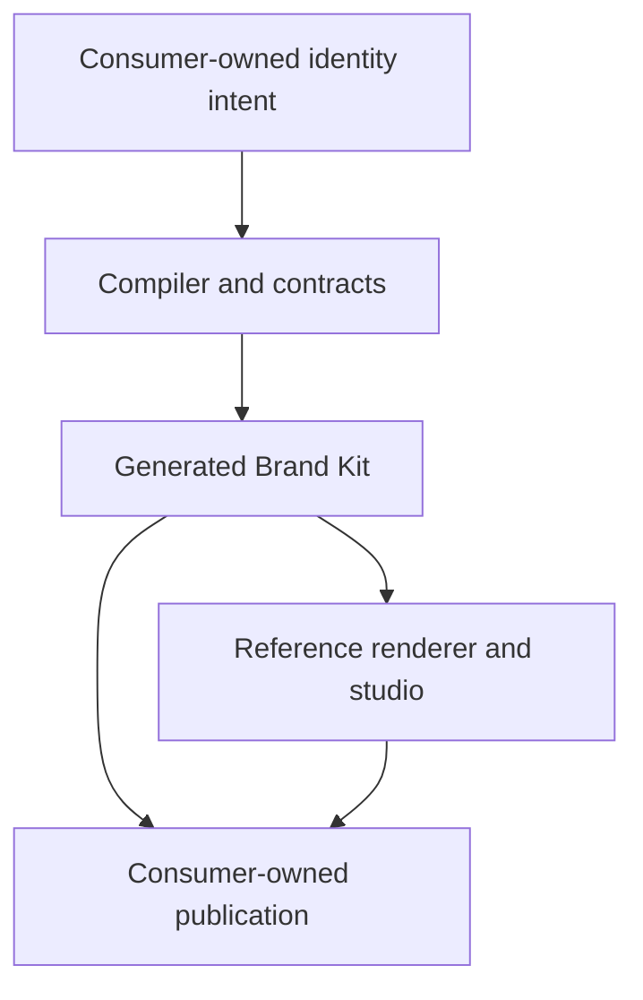

# Identity Architecture

## Purpose and scope

Identity uses a layered, contract-driven architecture to turn reviewed brand intent into verified Brand Kit projections and an understandable reference experience. This document owns structural boundaries, dependency direction, integration rules, authority boundaries, and current-to-target evolution. [SYSTEM.md](SYSTEM.md) owns logical responsibilities.

## Product architecture

The diagram expresses ownership and data flow, not a required framework or deployment topology.

## Internal layer model

1. **Intent and contracts** — identity source, schemas, accepted decisions, compatibility, and policy inputs.
2. **Domain** — canonical identity concepts, inheritance, overrides, approvals, projections, and provenance.
3. **Application** — validate, resolve, plan, render, verify, package, and handoff use cases.
4. **Ports and adapters** — filesystems, token transformers, vector/raster renderers, fonts, metadata, archives, providers, and frameworks.
5. **Interfaces** — CLI, library, packages, Brand Kit view model, reference renderer, reports, and automation contracts.
6. **Evidence** — diagnostics, tests, manifests, checksums, provenance, visual baselines, and health projections.

Dependencies point inward toward stable contracts and domain behavior. External libraries, frameworks, and providers do not become canonical domain truth.

## Data and authority flow

| Stage | Reads | May write | Must not do |
| --- | --- | --- | --- |
| Read | Canonical source and explicit configuration | Nothing | Resolve ambiguity silently |
| Validate | Parsed source and capability metadata | Diagnostics only | Mutate source or generated files |
| Resolve | Valid source, defaults, and overrides | In-memory resolved model | Hide inheritance or override conflicts |
| Plan | Resolved model and existing output state | Plan/evidence only | Apply changes |
| Render | Explicitly accepted plan and approved sources | Isolated generated work state | Publish or approve creative work |
| Verify | Source, outputs, manifest, fixtures, and policy | Validation evidence | Present partial coverage as success |
| Package | Verified outputs | Immutable package candidates | Replace canonical source |
| Publish | Approved immutable release | Consumer-owned deployment | Depend on a mutable default branch |

## Stable interfaces

- **Source contract:** versioned consumer-owned `.identity/` intent.
- **CLI contract:** local orchestration and human-readable/machine-readable diagnostics.
- **Compiler contract:** provider-independent domain and application ports, versioned plan/manifest schemas, adapter compatibility, and transactional generated-state recovery.
- **Package contract:** versioned profile selection and generated tokens, assets, metadata, guidance, indexes, checksums, deterministic archives, and compatibility as documented by [`docs/contracts/BRAND_KIT_PACKAGES_V1.md`](docs/contracts/BRAND_KIT_PACKAGES_V1.md).
- **Brand Kit view model:** framework-neutral public representation of an immutable release.
- **Renderer contract:** replaceable presentation of the view model.
- **Consumer contract:** pinned installation without access to repository internals.
- **Publication handoff:** explicit promotion and rollback metadata for an immutable release.
- **Evidence contract:** `identity.quality-report/v1` with stable statuses, coverage/skips, human-review boundaries, source/generated context, and release decisions as documented by [`docs/contracts/QUALITY_GATES_V1.md`](docs/contracts/QUALITY_GATES_V1.md); governed visual-motion producers additionally use `identity.motion-policy/v1` and `identity.visual-motion-manifest/v1` from [`docs/contracts/VISUAL_MOTION_V1.md`](docs/contracts/VISUAL_MOTION_V1.md).

Exact fields, commands, and package formats belong to their versioned specifications and roadmap issues.

## Repository ownership boundaries

| Repository/capability | Owns | Identity integration |
| --- | --- | --- |
| Hygiene | Organization policy and conformance requirements | Supplies versioned requirements; does not own product brand intent |
| Aether | Shared schemas, architecture vocabulary, and agent instructions | Governs document/contracts conventions through published artifacts |
| Holon | Reusable product components and templates | Consumes Identity tokens and packages; does not invent a second palette |
| Relay | Reusable CI/CD and release automation | Executes thin, pinned validation/release workflows; Relay #8 owns deterministic browser/demo capture that emits Identity-owned visual-motion provenance rather than defining a second motion policy |
| Pace | Fleet synchronization and conformance changes | Proposes or applies versioned consumer upgrades through explicit plans |
| Observatory | Organization health and evidence projection | Reads stable Identity validation and release evidence |
| Empathy | Baseline consumer and former incubation host | Owns its `.identity/` source and consumes an immutable Identity release |
| OptiFlow | Product consumer with distinct visual overrides | Demonstrates family defaults plus intentional product variation |
| Website repository | Public shell, route integration, deployment, redirect, and domain | Publishes an immutable Brand Kit artifact at `/identity` |
| Identity | Brand contracts, projections, packages, view model, reference renderer, and evidence | Never copies sibling internals or assumes their default branches |

## Public-route boundary

`https://egohygiene.io/identity` is the canonical organization Brand Kit route. `/brand-kit` is a permanent discoverability redirect. Identity owns the released Brand Kit bundle and publication contract; the website repository owns route wiring, the surrounding shell, deployment, redirect behavior, and rollback execution.

## Dependency rules

The operational admission, pinning, update, security, and replacement rules are
defined by the [dependency policy](docs/DEPENDENCY_POLICY.md).

- Sibling capabilities integrate through versioned public contracts, releases, packages, immutable commits, schemas, or documented APIs.
- Generated artifacts never become canonical source.
- Provider and framework adapters depend on application ports; core behavior does not depend on one adapter.
- Read, validate, resolve, plan, render, verify, package, approve, publish, and recover remain distinct when consequential.
- The reference renderer may use Holon components but Identity does not own or fork the component system.
- The compiler is deterministic and offline by default; networked generation is an explicit provider handoff.
- Transient state is ignored, disposable, and never promoted implicitly.

## Implemented compiler, package, quality, and motion boundary

The v1 compiler core is a public Rust library boundary described by
[`docs/contracts/COMPILER_V1.md`](docs/contracts/COMPILER_V1.md). It owns
framework-neutral models and ports for reading, validating, resolving, planning,
rendering, verification, manifests, adapter discovery, and generated-state
transactions.

Planning is mutation-free and records create, replace, remove, unchanged, or
blocked actions together with checksums, compatibility evidence, warnings, and
required approvals. Rendering and adapter verification complete before the
artifact store receives mutation authority. The local store stages verified
writes under `.cache/identity/transactions/`, backs up replacements/removals,
promotes the generated manifest last, and fails closed until an interrupted
transaction is explicitly recovered.

The built-in package layer consumes those ports rather than bypassing them. It
adds a framework-neutral `identity.brand-kit-model/v1`, nine semantically
versioned output profiles, and six offline adapters for token, metadata,
guidance, approved SVG, raster, and archive projections. Generated artifacts
include DTCG/CSS/JavaScript/TypeScript/Tailwind token packages, document CSS,
metadata and Open Graph projections, PWA/GitHub/social imagery, checksums,
package indexes, and a deterministic ZIP. SVG rasterization is isolated behind
the accepted `resvg` adapter boundary; archive bytes are produced by an
Identity-owned deterministic ZIP32 writer.

The compiler still rejects network-dependent or nondeterministic adapters. The
package layer does not make its output canonical, does not publish implicitly,
and does not add a generation CLI command.

The #12 quality layer sits downstream of the resolved Brand Kit and compiler
manifest. It owns `identity.quality-report/v1`, package/publication scopes,
release-blocking accessibility/provenance/license/reproducibility/visual checks,
explicit skipped coverage, visual-baseline comparison, and human-review
evidence. Source asset bytes remain separate from resolved source-governance
metadata so creative content and approval/license lineage do not collapse into
one authority object. Quality evaluation is read-only and cannot repair source,
rewrite generated artifacts, approve creative changes, or publish a release.

The #3 visual-motion layer extends that existing report rather than creating a
parallel validator. `identity.motion-policy/v1` constrains purpose-specific
duration/file-size budgets, cheap animated properties, easing, frame rate,
dimensions, deterministic capture modes, and reduced-motion behavior.
`identity.visual-motion-manifest/v1` records source license/approval, immutable
capture lineage, generator version, output digests/geometry/timing, behavioral
semantics, capture context, fallback digests, and baseline identity. Objective
checks are automated while motion meaning, direction/origin, and changed visual
baselines remain human decisions. Relay #8 is a downstream capture producer for
this contract, not an Identity runtime dependency.

Renderer interaction checks are deliberately skipped in package scope and become
blocking review requirements in publication scope until #14 supplies browser
evidence.

## Trust boundaries

Canonical source, generated work state, released packages, provider sessions, CI, and published surfaces are separate trust zones. Every crossing requires explicit data, authority, version, error, privacy, and recovery behavior. Credentials, private source material, and unapproved candidates never enter public artifacts or provenance intended for distribution.

## Current-to-target evolution

| Capability | Current evidence | Target |
| --- | --- | --- |
| Product contract | Accepted architecture documents | Maintained v1 boundary and compatibility policy |
| CLI foundation | Extracted workspace with `init`, `validate`, `plan`, and `handoff` parity evidence | Evolve through versioned contracts without losing the local-first authority boundary |
| Identity v1 source contract | Closed schemas, layered DTCG fixture, offline validator, adversarial diagnostics, and v0 migration plan | Preserve v1 compatibility while package and consumer layers consume the resolved model |
| Compiler pipeline | Deterministic Rust core, adapter registry, mutation-free plan, plan/manifest schemas, checksum evidence, transactional local store, recovery tests, and offline/compatibility gates | Preserve authority boundaries while downstream validation and interfaces evolve |
| Packages and projection validation | Nine versioned profiles, built-in offline adapters, DTCG/web/document/metadata/raster/archive projections, deterministic package/checksum schemas, cross-repository byte-identity tests, incremental tests, and subset-selection tests | Preserve package compatibility through real consumer/release proof |
| Quality and release evidence | `identity.quality-report/v1`, package/publication scopes, WCAG/reduced-motion/source-governance/SVG/PNG/manifest/budget checks, visual baselines, explicit skips, and human-review tests | Preserve the single release authority while #14 supplies browser evidence |
| Visual-motion governance | `identity.motion-policy/v1`, `identity.visual-motion-manifest/v1`, Astryx adopt/adapt/reject evidence, deterministic capture/provenance checks, purpose budgets, reduced-motion fallbacks, baseline review, and adversarial tests | Consume deterministic capture evidence from Relay #8 and renderer evidence from #14 without coupling Identity to their implementations |
| Renderer and studio | Proposed | Accessible framework-replaceable reference experience |
| Public route | Deferred pending released artifacts and website work | Immutable `/identity` deployment with `/brand-kit` redirect |

Implementation evidence determines availability. An accepted architecture direction is not itself an implemented runtime capability.
