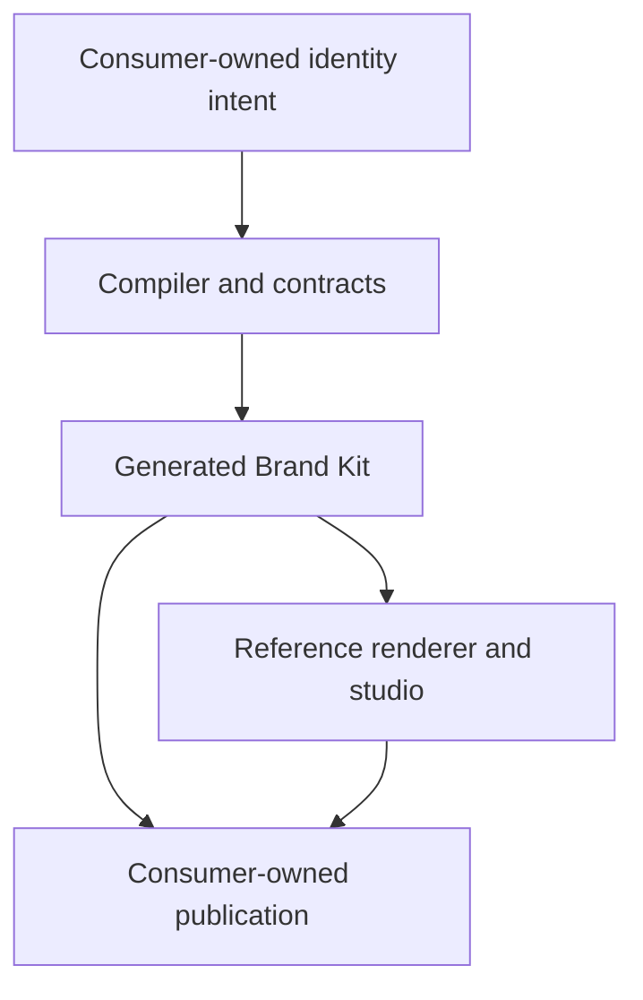

# Identity Architecture

## Purpose and scope

Identity uses a layered, contract-driven architecture to turn reviewed brand intent into verified Brand Kit projections and an understandable reference experience. This document owns structural boundaries, dependency direction, integration rules, authority boundaries, and current-to-target evolution. [SYSTEM.md](SYSTEM.md) owns logical responsibilities.

## Product architecture

The diagram expresses ownership and data flow, not a required framework or deployment topology.

## Internal layer model

1. **Intent and contracts** — identity source, schemas, accepted decisions, compatibility, and policy inputs.
2. **Domain** — canonical identity concepts, inheritance, overrides, approvals, projections, and provenance.
3. **Application** — validate, resolve, plan, render, verify, package, and handoff use cases.
4. **Ports and adapters** — filesystems, token transformers, vector/raster renderers, fonts, metadata, archives, providers, and frameworks.
5. **Interfaces** — CLI, library, packages, Brand Kit view model, reference renderer, reports, and automation contracts.
6. **Evidence** — diagnostics, tests, manifests, checksums, provenance, visual baselines, and health projections.

Dependencies point inward toward stable contracts and domain behavior. External libraries, frameworks, and providers do not become canonical domain truth.

## Data and authority flow

| Stage | Reads | May write | Must not do |
| --- | --- | --- | --- |
| Read | Canonical source and explicit configuration | Nothing | Resolve ambiguity silently |
| Validate | Parsed source and capability metadata | Diagnostics only | Mutate source or generated files |
| Resolve | Valid source, defaults, and overrides | In-memory resolved model | Hide inheritance or override conflicts |
| Plan | Resolved model and existing output state | Plan/evidence only | Apply changes |
| Render | Explicitly accepted plan and approved sources | Isolated generated work state | Publish or approve creative work |
| Verify | Source, outputs, manifest, fixtures, and policy | Validation evidence | Present partial coverage as success |
| Package | Verified outputs | Immutable package candidates | Replace canonical source |
| Publish | Approved immutable release | Consumer-owned deployment | Depend on a mutable default branch |

## Stable interfaces

- **Source contract:** versioned consumer-owned `.identity/` intent.
- **CLI contract:** local orchestration and human-readable/machine-readable diagnostics.
- **Compiler contract:** provider-independent domain and application ports.
- **Package contract:** versioned tokens, assets, metadata, voice, manifests, checksums, and compatibility.
- **Brand Kit view model:** framework-neutral public representation of an immutable release.
- **Renderer contract:** replaceable presentation of the view model.
- **Consumer contract:** pinned installation without access to repository internals.
- **Publication handoff:** explicit promotion and rollback metadata for an immutable release.
- **Evidence contract:** stable diagnostics and reports consumable by CI and Observatory.

Exact fields, commands, and package formats belong to their versioned specifications and roadmap issues.

## Repository ownership boundaries

| Repository/capability | Owns | Identity integration |
| --- | --- | --- |
| Hygiene | Organization policy and conformance requirements | Supplies versioned requirements; does not own product brand intent |
| Aether | Shared schemas, architecture vocabulary, and agent instructions | Governs document/contracts conventions through published artifacts |
| Holon | Reusable product components and templates | Consumes Identity tokens and packages; does not invent a second palette |
| Relay | Reusable CI/CD and release automation | Executes thin, pinned validation and release workflows |
| Pace | Fleet synchronization and conformance changes | Proposes or applies versioned consumer upgrades through explicit plans |
| Observatory | Organization health and evidence projection | Reads stable Identity validation and release evidence |
| Empathy | Baseline consumer and former incubation host | Owns its `.identity/` source and consumes an immutable Identity release |
| OptiFlow | Product consumer with distinct visual overrides | Demonstrates family defaults plus intentional product variation |
| Website repository | Public shell, route integration, deployment, redirect, and domain | Publishes an immutable Brand Kit artifact at `/identity` |
| Identity | Brand contracts, projections, packages, view model, reference renderer, and evidence | Never copies sibling internals or assumes their default branches |

## Public-route boundary

`https://egohygiene.io/identity` is the canonical organization Brand Kit route. `/brand-kit` is a permanent discoverability redirect. Identity owns the released Brand Kit bundle and publication contract; the website repository owns route wiring, the surrounding shell, deployment, redirect behavior, and rollback execution.

## Dependency rules

The operational admission, pinning, update, security, and replacement rules are
defined by the [dependency policy](docs/DEPENDENCY_POLICY.md).

- Sibling capabilities integrate through versioned public contracts, releases, packages, immutable commits, schemas, or documented APIs.
- Generated artifacts never become canonical source.
- Provider and framework adapters depend on application ports; core behavior does not depend on one adapter.
- Read, validate, resolve, plan, render, verify, package, approve, publish, and recover remain distinct when consequential.
- The reference renderer may use Holon components but Identity does not own or fork the component system.
- The compiler is deterministic and offline by default; networked generation is an explicit provider handoff.
- Transient state is ignored, disposable, and never promoted implicitly.

## Trust boundaries

Canonical source, generated work state, released packages, provider sessions, CI, and published surfaces are separate trust zones. Every crossing requires explicit data, authority, version, error, privacy, and recovery behavior. Credentials, private source material, and unapproved candidates never enter public artifacts or provenance intended for distribution.

## Current-to-target evolution

| Capability | Current evidence | Target |
| --- | --- | --- |
| Product contract | Accepted architecture documents | Maintained v1 boundary and compatibility policy |
| CLI foundation | Extracted workspace with `init`, `validate`, `plan`, and `handoff` parity evidence | Evolve through versioned contracts without losing the local-first authority boundary |
| Identity v1 source contract | Closed schemas, layered DTCG fixture, offline validator, adversarial diagnostics, and v0 migration plan | Preserve v1 compatibility while the compiler adopts the resolved model |
| Brand guidance model | Versioned voice/usage source, approval-aware context retrieval, and golden JSON/Markdown/HTML projections | Supply the immutable model to packages and the public renderer without changing human authority |
| Compiler pipeline | Proposed issues and prior planning behavior | Deterministic adapter pipeline over the validated v1 model |
| Packages and validation | Proposed | Reproducible distributions with release-blocking evidence |
| Public renderer and studio | Proposed | Accessible framework-replaceable reference experience over the implemented guidance model |
| Public route | Deferred pending released artifacts and website work | Immutable `/identity` deployment with `/brand-kit` redirect |

Implementation evidence determines availability. An accepted architecture direction is not itself an implemented runtime capability.
