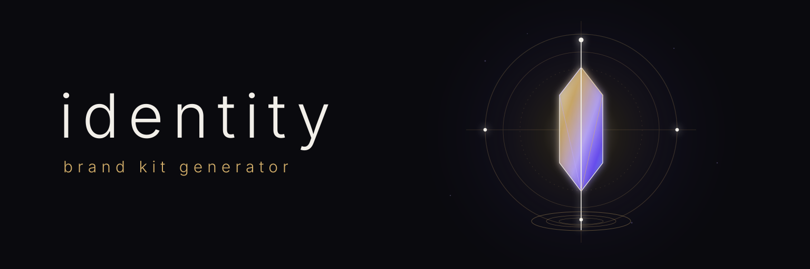
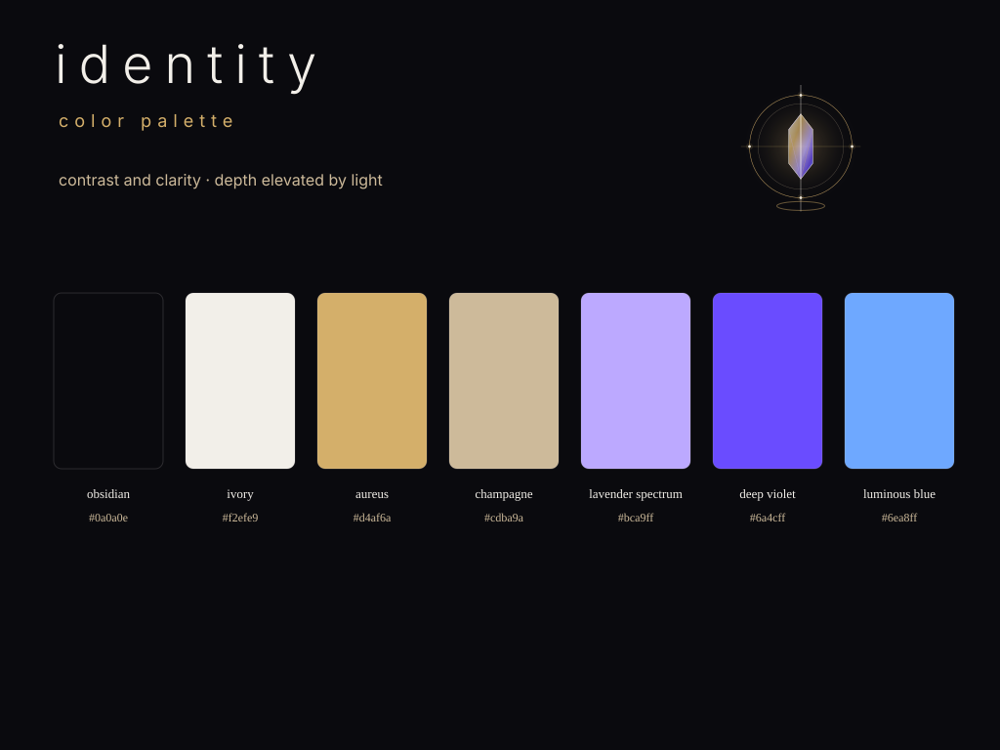

<p align="center">
  
</p>

# Identity

🪪 Identity is an open-source Brand Kit generator that turns reviewed brand intent into reproducible design tokens, creative guidance, platform assets, distributable packages, and a public Brand Kit.

## Product contract

A consumer owns its identity source. Identity validates that source, plans deterministic projections, generates derived artifacts, verifies the result, and records evidence without replacing human creative authority.

```text
project-owned .identity/ intent
        ↓
Identity validate → resolve → plan → render → verify
        ↓
assets/identity/ + versioned packages + Brand Kit view model
        ↓
product consumers + public Brand Kit
```

The canonical Identity Brand Kit is published at
[`https://identity.egohygiene.io/`](https://identity.egohygiene.io/). The
identity repository owns that standalone tool surface; the main
`egohygiene.io` website and Flutter application retain host and homepage
ownership. Identity now defines a content-addressed LaunchKit and Zensical
dogfood artifact for `https://egohygiene.io/identity/` without transferring
brand authority into either framework. See the
[public Brand Kit publication guide](docs/publication/IDENTITY_PAGES.md).

## Brand Kit preview

The first human-approved self-hosting visual direction now lives under [`assets/identity/`](assets/identity/README.md). These are generated projections—not a replacement for the future canonical `.identity/` source contract.

Kern, the approved Identity guide, now dogfoods the v1
[mascot and character-system contract](docs/contracts/MASCOT_SYSTEM_V1.md).
His three glowing eyes represent context, intent, and verified projection; the
identity kernel is integrated into his outfit rather than floating as a prop.

<p align="center">
  
</p>

<p align="center">
  
</p>

<p align="center">
  <a href="assets/identity/guidelines/design-system.svg">design system board</a> ·
  <a href="assets/identity/guidelines/usage-guidelines.svg">usage guidelines</a> ·
  <a href="assets/identity/mascot/manifest.json">mascot package</a> ·
  <a href="assets/identity/manifest.json">asset manifest</a>
</p>

## The three product layers

| Layer | Responsibility | Primary outputs |
| --- | --- | --- |
| Compiler and contracts | Model, validate, resolve, plan, render, and verify reviewed identity intent | Diagnostics, plans, manifests, and evidence |
| Generated Brand Kit | Project the resolved identity into portable assets and packages | Tokens, marks, metadata, guidance, archives, and typed packages |
| Reference experience | Present and safely preview the generated Brand Kit | Public renderer, downloads, and approval-aware asset studio |

Frameworks, renderers, and providers remain replaceable adapters around these stable layers.

## CLI foundation

The independently buildable Rust CLI currently preserves four local-first
commands from the Empathy incubation:

```bash
cargo run -- init \
  --repository-root "path/to/consumer" \
  --project-id "consumer" \
  --display-name "Consumer"

cargo run -- validate --repository-root "path/to/consumer"

cargo run -- plan \
  --repository-root "path/to/consumer" \
  --format "markdown"

cargo run -- handoff \
  --repository-root "path/to/consumer" \
  --output-directory ".cache/identity/handoff"

cargo run -- studio-review \
  --repository-root "path/to/consumer" \
  --handoff "review/identity-approved-handoff.json" \
  --release-view-model "assets/identity/brand-kit-view-model.json" \
  --output ".cache/identity/studio-review.json" \
  --format "markdown"
```

`init` creates consumer-owned `.identity/` intent. `validate` checks the v0
project and profile contracts. `plan` resolves eight profiles and 45 targets
without generating them. `handoff` creates a deterministic, provenance-aware
creative source-pack request whose candidates remain unapproved by default.
`studio-review` accepts only a named, explicitly approved local-studio handoff
that matches an immutable Brand Kit release; it resolves the selected existing
CLI profiles into a deterministic review plan. It does not write canonical
`.identity/` source or generated assets; an optional saved review record must
remain outside both locations.

Raster/vector rendering, asset application, packaging, and publication remain
outside this extracted CLI vertical slice. See the
[Empathy extraction evidence](docs/migration/EMPATHY_EXTRACTION.md).

## Identity v1 source

The v1 contract adds content-addressed organization defaults, intentional
product overrides, DTCG-compatible semantic tokens, versioned target profiles,
asset provenance/licensing, and human approvals beneath `.identity/`.

```bash
python3 scripts/validate_identity.py \
  --repository-root "tests/fixtures/v1/valid/minimal" \
  --format "human"

python3 scripts/plan_v0_migration.py \
  --repository-root "tests/fixtures/migration/empathy-v0" \
  --format "human"
```

Both tools are standard-library-only, offline, and non-mutating. The complete
[v1 contract](docs/contracts/IDENTITY_V1.md) documents topology, merge order,
aliases, compatibility, diagnostics, migration, and rollback.

Validated v1 consumers can use the explicit package boundary without importing
compiler internals:

```bash
cargo run -- v1-generate --repository-root "path/to/consumer"
cargo run -- v1-verify --repository-root "path/to/consumer"
```

`v1-generate` resolves the selected versioned profiles, writes a transactional
package and compiler manifest beneath `assets/identity/`, and never writes
canonical `.identity/` source. `v1-verify` is read-only; it fails when the
selected package is missing, stale, or drifted. Consumers run the standalone
validator first to obtain the complete stable source diagnostics.

## Governed brand guidance

Voice, contextual tone, vocabulary, examples, anti-examples, usage rules,
accessibility, legal notes, localization, legacy assets, and approval state are
first-class Identity v1 source. Public output includes only approved public
records; the review projection preserves candidate, approved, rejected, and
superseded decisions with their human-review evidence.

```bash
python3 scripts/render_guidance.py \
  --repository-root "tests/fixtures/v1/valid/minimal" \
  --audience "public" \
  --format "html" \
  --output "build/brand-guidance.html"

python3 scripts/render_guidance.py \
  --repository-root "tests/fixtures/v1/valid/minimal" \
  --audience "review" \
  --context "support" \
  --format "json"
```

The renderer validates source before projection, never invents brand prose,
and refuses to write beneath canonical `.identity/`. The
[guidance v1 contract](docs/contracts/GUIDANCE_V1.md) defines authority,
lifecycle, context retrieval, deterministic JSON/Markdown/HTML outputs, and
legacy-asset publication policy.

## Press and Media Kits

Consumers can opt into a governed Press Kit source without making publication
or deployment part of their canonical identity contract. Identity projects only
approved public boilerplate, facts, links, contacts, supplied team biographies,
and explicitly selected approved assets into a deterministic package:

```bash
python3 scripts/render_press_kit.py \
  --repository-root "path/to/consumer" \
  --output-directory "assets/identity/press-kit"
```

The output includes JSON, Markdown, an integrity manifest, checksums, selected
assets, and a deterministic ZIP. It is ready for a consumer-owned release or
site deployment step, but does not publish anything itself. See the
[Press Kit and Media Kit contract](docs/contracts/PRESS_KIT_V1.md).

## Social-surface packages

Consumers can explicitly map approved Identity assets and project metadata to
stable records in a repository-local, digest-pinned Aether catalog:

```bash
python3 scripts/render_social_surfaces.py \
  --repository-root "path/to/consumer" \
  --output-directory "assets/identity/social-surfaces"
```

Identity never fetches platform facts or generates an implicit platform
matrix. The package retains exact dimensions, media constraints, safe-zone
state, source verification, approvals, provenance, a manifest, checksums, and
a deterministic archive. It is renderer-ready input with publication authority
explicitly denied. See the
[social-surface projection contract](docs/contracts/SOCIAL_SURFACES_V1.md).

## Compiler core

The Rust library exposes the deterministic framework-neutral compiler boundary
behind the Brand Kit generator:

```text
read → validate → resolve → plan → render → verify → manifest
                                      │
                                      └─ transactional apply after approval
```

The compiler provides mutation-free plans, adapter capability/compatibility
records, stable diagnostics, SHA-256 fingerprints and manifests, incremental
unchanged detection, pre-apply verification, and explicit recovery for
interrupted generated-state transactions. Network-dependent or nondeterministic
projection adapters are rejected from the compiler-owned path.

The [compiler v1 contract](docs/contracts/COMPILER_V1.md) documents the public
Rust ports plus `identity.compiler-plan/v1` and
`identity.compiler-manifest/v1`. The `v1-generate` and `v1-verify` commands
are the narrow consumer boundary for this package flow; the existing v0 CLI
commands retain their extraction-parity contract.

## Brand Kit packages

The built-in package layer implements nine versioned output profiles over the
compiler ports: `core`, `web`, `pwa`, `github`, `docs`, `social`, `tokens`,
`metadata`, and `archive`.

Those profiles can deterministically project a resolved identity into:

- DTCG JSON, CSS custom properties, JavaScript, TypeScript declarations, and a
  Tailwind-compatible theme;
- document CSS, public metadata, Open Graph markup, PWA icon metadata, and
  explicit voice/usage guidance state;
- approved SVG marks plus PNG favicon, PWA, maskable, social-card, and GitHub
  preview assets through the offline `resvg` adapter boundary;
- package metadata, SHA-256 indexes/checksums, and a deterministic downloadable
  ZIP with fixed ordering and timestamps.

Consumers select profile IDs and compatible versions; selecting a subset does
not generate unrelated profiles. The compiler manifest remains the transaction
and evidence record for the exact selected build. The
[Brand Kit packages v1 contract](docs/contracts/BRAND_KIT_PACKAGES_V1.md)
defines the stable generated interface, compatibility rules, archive semantics,
and consumer boundary.

## Quality and release evidence

The shared quality layer evaluates a resolved Brand Kit and its compiler manifest
without mutating canonical or generated state. It emits the versioned
`identity.quality-report/v1` contract with one deterministic release decision,
coverage counts, stable check identifiers, source/generated context, and
recovery guidance.

`package` scope validates distributable output while explicitly recording
renderer-only interaction checks as skipped. `publication` scope turns those
same checks into blocking review requirements until the reference renderer owns
real browser evidence. Automated checks cover semantic contrast, reduced-motion
budgets, source integrity, licenses and provenance, SVG structure, target file
budgets, raster dimensions, manifest drift, maskable safe-zone evidence, and
visual baselines. Creative baseline changes and small-size legibility remain
explicit human decisions rather than automated approval.

The [quality gates v1 contract](docs/contracts/QUALITY_GATES_V1.md) defines the
status vocabulary, default budgets, review evidence, failure/recovery semantics,
and the extension boundary used by visual-motion governance.

## Visual-motion governance

The visual-motion layer extends that same `identity.quality-report/v1` release
decision with versioned `identity.motion-policy/v1` and
`identity.visual-motion-manifest/v1` contracts. It validates animation,
generated imagery, landing sequences, continuous-status motion, and
deterministic demo captures without creating a second release authority.

The default policy is meaning-first and conservative: UI movement uses
`transform`/`opacity`, standard decelerating easing, bounded purpose-specific
durations and file sizes, non-blocking interaction, deterministic synthetic
capture state, and real reduced-motion fallbacks where pre-rendered motion is
used. Motion meaning, direction/origin, and intentional baseline changes remain
explicit human-review boundaries.

The [visual-motion v1 contract](docs/contracts/VISUAL_MOTION_V1.md) defines the
stable runtime/evidence boundary. The
[Astryx evaluation](docs/evaluations/astryx-motion-patterns.md) records the
pinned upstream research, MIT license decision, and adopt/adapt/reject matrix.
Relay #8 owns deterministic browser/demo capture and should emit this
Identity-owned provenance contract; Relay does not become motion-policy owner.

## State and authority

| State | Owner | Meaning |
| --- | --- | --- |
| Canonical | Consumer | Human-reviewed intent under `.identity/` |
| Generated | Identity | Reproducible outputs under `assets/identity/` and released packages |
| Transient | Active interface | Preview, cache, candidate, and work state that cannot silently become canonical |
| Published | Owning surface | An immutable approved release integrated and deployed by the website or consumer repository |

## What Identity owns

- brand contracts, schemas, inheritance, overrides, and compatibility;
- semantic design tokens, voice guidance, metadata, usage rules, and target profiles;
- deterministic asset planning, projection, validation, manifests, and provenance;
- distributable Brand Kit packages and a framework-neutral view model;
- the reference Brand Kit renderer and approval-aware asset studio contract.

## What Identity does not own

- product UI components and templates, which belong to Holon;
- organization policy, which belongs to Hygiene;
- shared agent instructions and architecture schemas, which belong to Aether;
- reusable CI/CD implementation, which belongs to Relay;
- consumer source intent or the website deployment shell;
- raw asset archives, generic logo generation, or silent publication of generated creative work.

## Current capability state

The Brand Kit product contract and toolchain decisions are accepted. The
extracted CLI, v1 source contract, deterministic compiler core, built-in
projection/package layer, shared quality/evidence harness, governed
visual-motion validation, voice/usage/approval guidance, reference renderer,
asset studio, and Empathy/OptiFlow pilot integrations are implemented. The
v1.0.0 source is prepared for final tagged publication after the full
cross-platform, provenance, and support evidence passed. The separately
deployed public website remains outside this CLI release transaction.

| Capability | State | Tracking |
| --- | --- | --- |
| Brand Kit product contract | Accepted | [#6](https://github.com/egohygiene/identity/issues/6) |
| Toolchain decisions | Accepted | [#7](https://github.com/egohygiene/identity/issues/7), [evaluation](docs/evaluations/brand-kit-foundations.md), [ADRs](DECISIONS.md) |
| Independent CLI | Implemented | [#8](https://github.com/egohygiene/identity/issues/8) |
| v1 identity schema | Implemented | [#9](https://github.com/egohygiene/identity/issues/9), [contract](docs/contracts/IDENTITY_V1.md) |
| Compiler core | Implemented | [#10](https://github.com/egohygiene/identity/issues/10), [contract](docs/contracts/COMPILER_V1.md) |
| Projection adapters and packages | Implemented | [#11](https://github.com/egohygiene/identity/issues/11), [contract](docs/contracts/BRAND_KIT_PACKAGES_V1.md) |
| Quality and release evidence | Implemented | [#12](https://github.com/egohygiene/identity/issues/12), [contract](docs/contracts/QUALITY_GATES_V1.md) |
| Visual-motion validation | Implemented in this change | [#3](https://github.com/egohygiene/identity/issues/3), [contract](docs/contracts/VISUAL_MOTION_V1.md), [Astryx evaluation](docs/evaluations/astryx-motion-patterns.md) |
| Voice, usage, and approval guidance | Implemented | [#13](https://github.com/egohygiene/identity/issues/13), [contract](docs/contracts/GUIDANCE_V1.md) |
| Renderer and asset studio | Implemented | [#14](https://github.com/egohygiene/identity/issues/14), [#15](https://github.com/egohygiene/identity/issues/15) |
| Public Brand Kit site | Release-backed GitHub Pages deployment at `identity.egohygiene.io` | [#16](https://github.com/egohygiene/identity/issues/16), [publication guide](docs/publication/IDENTITY_PAGES.md) |
| Dogfooded Identity experience | Deterministic LaunchKit + Zensical composite and review-gated `/identity/` handoff | [#57](https://github.com/egohygiene/identity/issues/57), [experience guide](experience/README.md) |
| Consumer pilots | Implemented | [#17](https://github.com/egohygiene/identity/issues/17), [Empathy #77](https://github.com/egohygiene/empathy/pull/77), [OptiFlow #46](https://github.com/egohygiene/optiflow/pull/46) |
| v1.0.0 release | Stable source prepared; final tag records the release evidence | [#18](https://github.com/egohygiene/identity/issues/18), [release guide](docs/releases/V1.md) |
| Design-system handbook and AI context | Implemented; consumer handoff remains next | [#35](https://github.com/egohygiene/identity/issues/35), [contract](docs/contracts/DESIGN_SYSTEM_V1.md) |
| Press Kit and Media Kit | Implemented | [#34](https://github.com/egohygiene/identity/issues/34), [contract](docs/contracts/PRESS_KIT_V1.md) |
| Pinned social-surface packages | Implemented | [#52](https://github.com/egohygiene/identity/issues/52), [contract](docs/contracts/SOCIAL_SURFACES_V1.md) |

The umbrella [#2](https://github.com/egohygiene/identity/issues/2) records the
compiler/package outcome. The Empathy and OptiFlow proof has landed through
#17; #18 now provides the installable release and evidence boundary.

## Architecture

- [Purpose](PURPOSE.md)
- [Vision](VISION.md)
- [Principles](PRINCIPLES.md)
- [Pillars](PILLARS.md)
- [System responsibilities](SYSTEM.md)
- [Architecture and boundaries](ARCHITECTURE.md)
- [Design system contract](DESIGN_SYSTEM.md)
- [Architecture decisions](DECISIONS.md)
- [Brand Kit foundations evaluation](docs/evaluations/brand-kit-foundations.md)
- [Dependency policy](docs/DEPENDENCY_POLICY.md)
- [v1 release guide](docs/releases/V1.md)
- [release process](docs/releases/RELEASE_PROCESS.md)
- [public Brand Kit publication](docs/publication/IDENTITY_PAGES.md)
- [security policy](SECURITY.md)
- [support policy](SUPPORT.md)
- [Identity v1 source contract](docs/contracts/IDENTITY_V1.md)
- [Guidance v1 contract](docs/contracts/GUIDANCE_V1.md)
- [Compiler v1 contract](docs/contracts/COMPILER_V1.md)
- [Brand Kit packages v1 contract](docs/contracts/BRAND_KIT_PACKAGES_V1.md)
- [Quality gates v1 contract](docs/contracts/QUALITY_GATES_V1.md)
- [Visual-motion v1 contract](docs/contracts/VISUAL_MOTION_V1.md)
- [Design-system handbook and context contract](docs/contracts/DESIGN_SYSTEM_V1.md)
- [Press Kit and Media Kit contract](docs/contracts/PRESS_KIT_V1.md)
- [Social-surface projection contract](docs/contracts/SOCIAL_SURFACES_V1.md)
- [Astryx motion-pattern evaluation](docs/evaluations/astryx-motion-patterns.md)
- [Roadmap](ROADMAP.md)

The [roadmap issue](https://github.com/egohygiene/identity/issues/5) is the execution source of truth. Architecture documents define durable intent and boundaries; individual issues own implementation detail and evidence.
